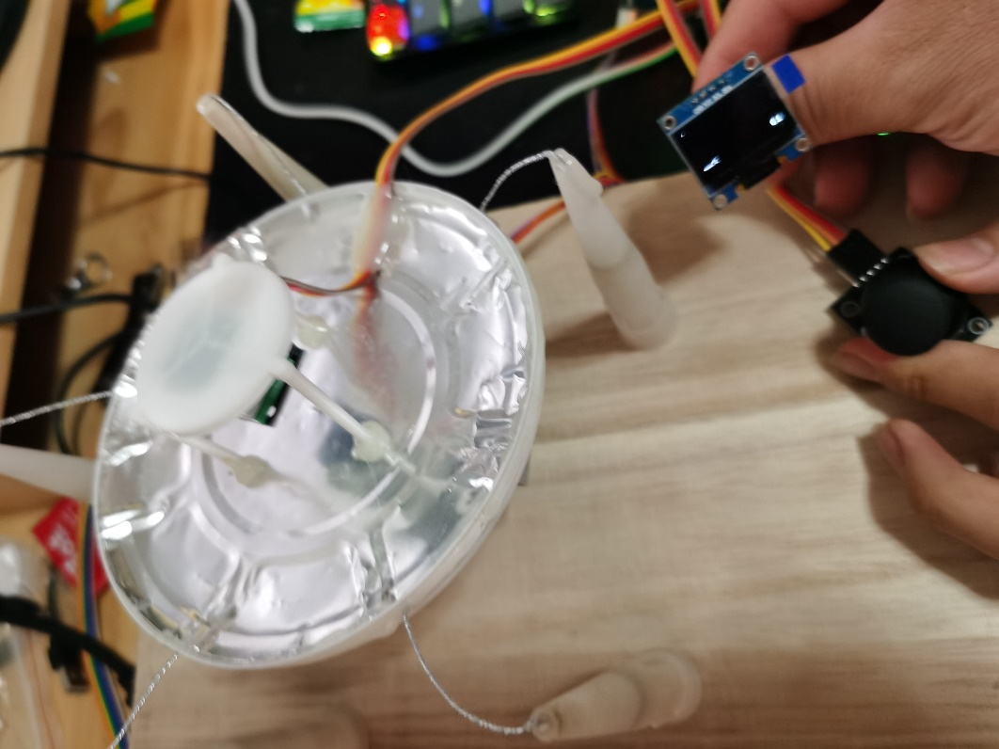
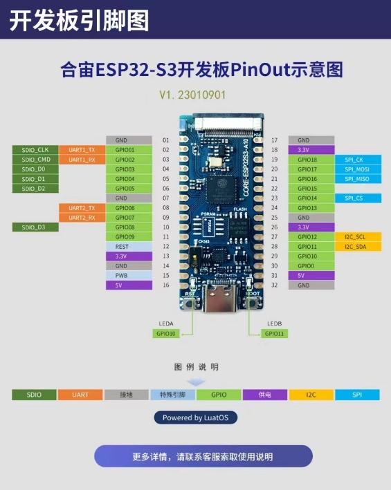
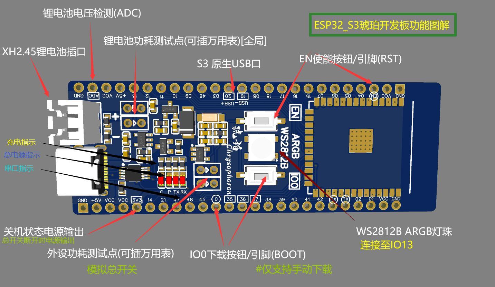
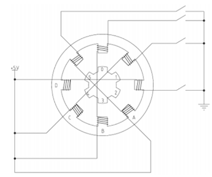
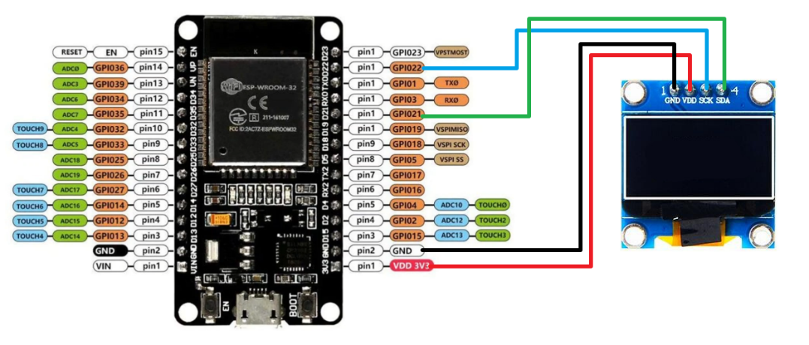

# RadioTelescope

> 学校要求的模拟天眼项目，源码发出来供广大高中学子参考（）

> 三班一组 Glomzzz

基于ESP32-S3与Micro Python

本项目已开源到[**Github**](https://github.com/Glomzzz/RadioTelescope)，供广大高中学子参考(MIT协议)

如果你喜欢本项目，请为我点一个Star

## 制作材料

### ESP32-S3

三．功能介绍：

 

1.      支持锂电池系统，通过动态电源管理电路，在有USB（5V）输入时，使用5V电源供电，同时给锂电池充电（拥有过冲保护）；当无USB（5V）输入时，使用锂电池进行供电，拥有充电指示灯和总电源指示灯。

2.      同时锂电池通过分压电阻将电压输出至（ADC引脚）,可以通过ESP32S3所带的ADC对锂电池剩余容量进行测量。

3.      通过一个跳线帽和测试口组成的功耗测试点可以通过插万用表对锂电池功耗（全局功耗）以及外设功耗（局部功耗）进行测试。

4.      同时映出了3V3和VCC两个外设电源脚，VCC在总开关后，作为常规外设的电源，3V3在总开关之前，作为全天候工作外设的电源（实时时钟，加速度传感器）。

5.      带有一个WS2812B  ARGB灯珠，连接至IO13。

6.     使用CH340E作为转串口芯片，所以需要手动进入下载模式。

7.      LDO部分使用ME6211C33M5G低压差LDO，提供最高500ma的电流，可以让ESP32S3模组在最高速率进行WIFI通讯+LCD彩屏+多个传感器的条件下工作。

8.      部分S3模组的IO35,36,37是没有映出的，所以在开发板上标注出了特殊引脚的位置

### 步进电机

 

ABCD为定子，上面绕有线圈，为四相，与之相对应的对面四个定子上面也有线圈，相对应的两个定子之间线圈是相互连接形成一个绕组。

**单四拍模式**：

如当前为初始状态，B相导通，对0的吸引力最大。

接下来B断开，C导通，1和C相之间夹角最小被吸引过去，被吸引过去之前2和D相之间夹角为1和C相之间夹角的2倍，1被吸引到C以后，2和D之间最近，此时0和A之间的夹角为2和D之间的2倍，

接下来C断开，D导通，2被吸引到D，此时0距离A最近

D断开A导通，0被吸引到A相，至此一个周期完成

**双拍工作模式**：

每次给两个线圈通电，通过改变通电的线圈从而使步进电机转动 五线四相步进电机：在双拍工作方式下，线圈的通电方式依次是：AB、BC、CD、DA 即单拍工作方式下，线圈的通电方式依次是：A、B、C、D

**单双拍（八拍工作方式）**

单双拍工作方式就是单拍工作方式和双拍工作方式交替进行。 五线四相步进电机：A、AB、B、BC、C、CD、D、DA；

本项目使用的是**单四拍工作模式**

### 100x100 OLED屏幕

基于**SSD1306**驱动 （驱动源码见Github）

### 若干导线，乐高，木板，热熔胶

## 制作过程

本着低成本高效率的制作初衷，我选用了ESP32-S3这块板子，可以提供足够的功率供OLED屏幕与步进电机运作。

说实话本来想用Rust写，奈何生态不发达，最终还是用了MicroPython。

焊接电路板，接针脚，装模块。。。

最后简简单单地做了出来···。。

---

2024年04月16日.

现在Espressif on Rust的体验已经很好了. 适配S3也不错.

不过我不太打算RIIR了( )